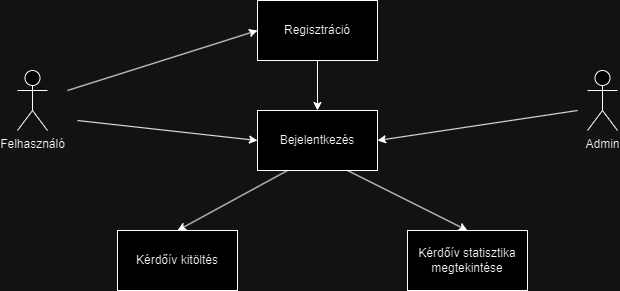
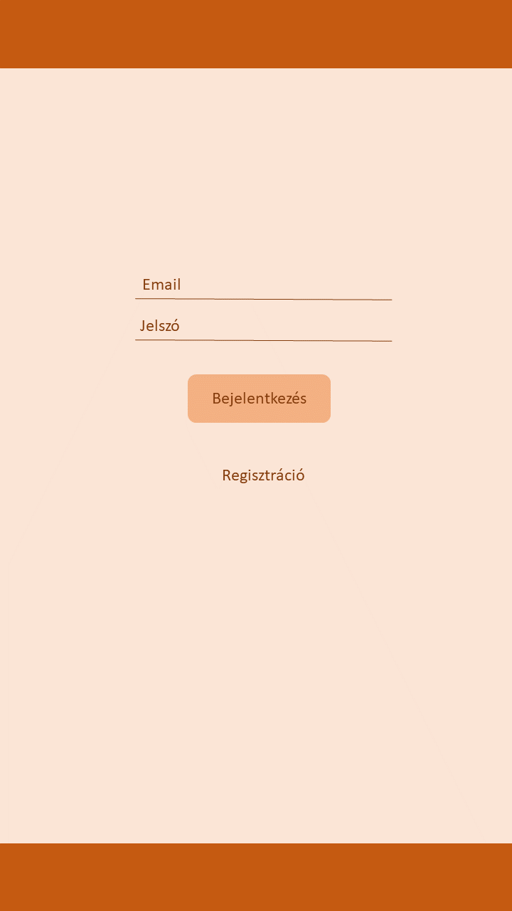
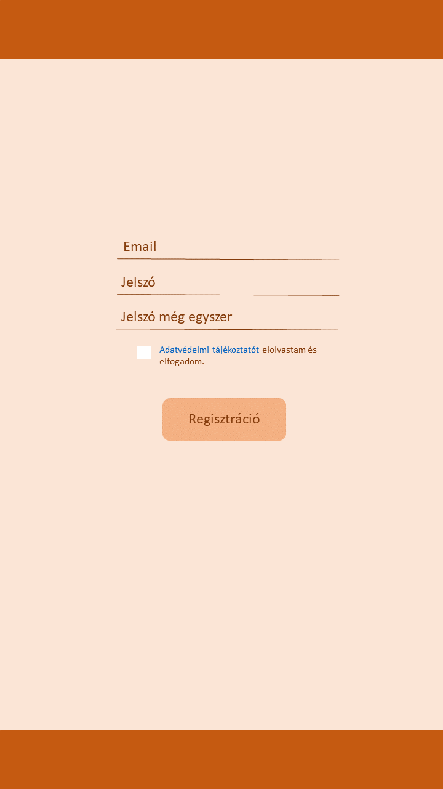
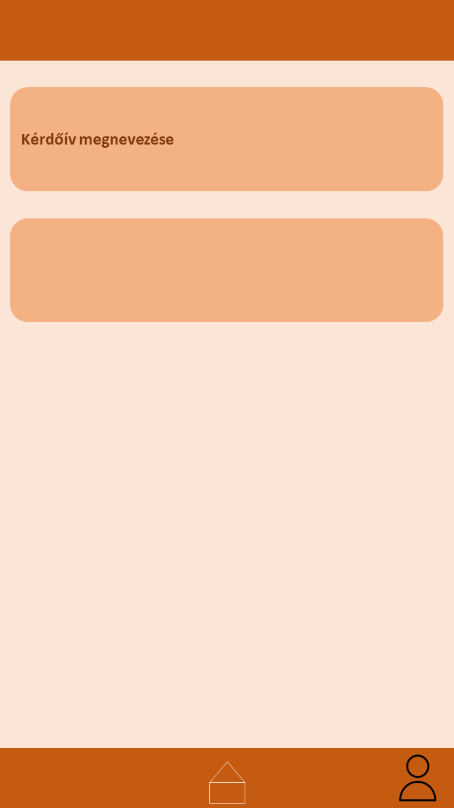
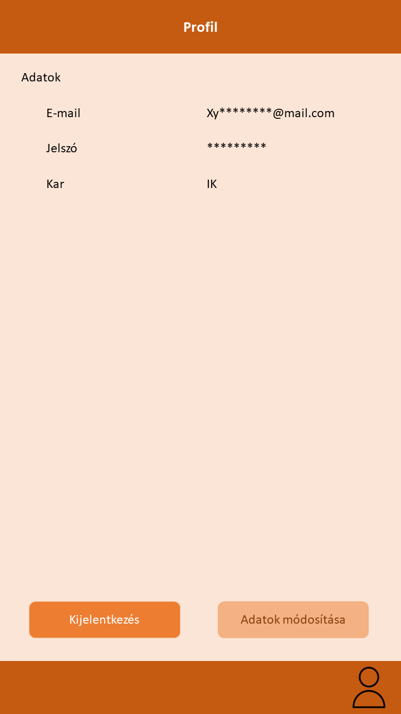
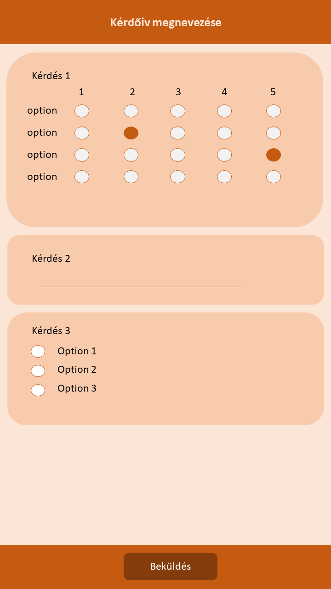
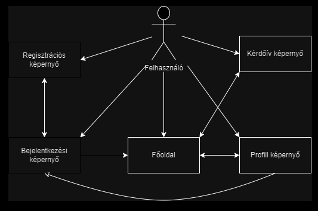
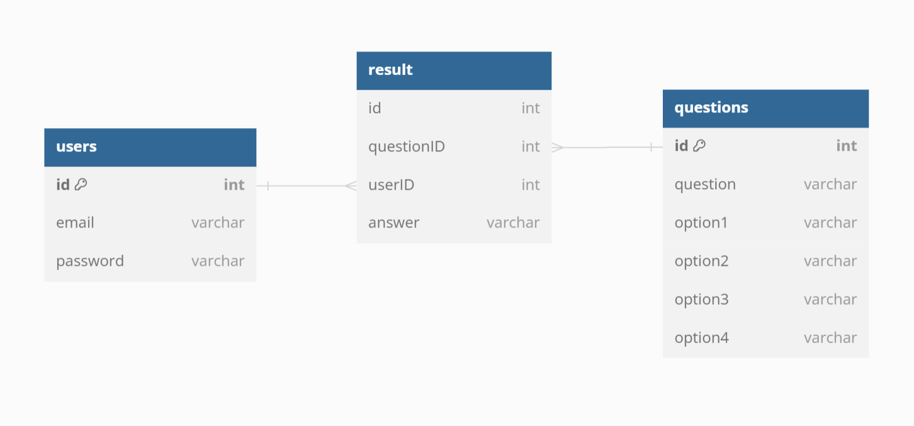

# Rendszerterv

## A rendszer célja
### (Definiálja a rendszer célját. Gyakran leírjuk azt is, ami nem cél, hogy ezzel is tisztázzuk a feladat kört (scope), amit meg akarunk oldani.)
A rendszer célja egy olyan Android alkalmazás létrehozása, amelyet csak az egyetem hallgatói
használhatnak csak. Az alkalmazás egy Questionnare, vagyis egy olyan applikáció, amelyben a
diákok (ez esetben a felhasználók) az egyetemmel kapcsolatos kvízeket tölthetnek ki. Ezek a
kvízek az egyetemmel kapcsolatosak, annak javulására szolgálnak. A kvízekben a kérdések fajtái
lehetnek többfélék, feleletválasztósak, vagy akár kifejtendőek is. A cél egy stabil adatbázisrendszer 
létrehozása, amely tárolja a felhasználók bejelentkezési adatait, valamint a kérdésekre adott 
válaszaikat is. Kiemelendő az a kitűzésünk is, hogy ezt teljesen törvényesen, valamint úgy akarjuk
megalkotni, hogy az adatok biztonságban legyenek. Lehetőleg olyan rendszert állítanánk fel, ahol 
a kvízeket lehet módosítani, törölni valamint teljesen újakat létrehozni. A tervezés közbeni hibákat 
minél jobban szeretnénk elkerülni vagy esetleg teljesen kijavítani. Fontos azonban, hogy olyan 
rendszert hozzunk létre, amelyet olyan diákok is könnyedén tudjanak használni, akik nem rendelkeznek 
kiemelkedő informatikai tudással, vagyis az applikáció felhasználóbarát legyen. 

## Projektterv
A projekt végrehajtásához négy csapattag fog részt venni, akik különböző szerepköröket töltenek be.
A projekt során az alábbi szerepkörök és felelősségeik kerülnek kijelölésre:

### Projektszerepkörök, felelőségek
* Scrum Master: Papp Gréta.
  * A Scrum Master felelős a projekt folyamatának és munkafolyamatainak hatékony menedzseléséért. Ő
  segíti a csapatot a Scrum keretrendszer alkalmazásában és gondoskodik arról, hogy a csapat zökkenőmentesen
  haladjon előre a projekt során.
* Product Owner: Varga Petra.
  * Ő felelős a projekt céljainak és prioritásainak meghatározásáért. A Product Owner az ügyfél igényeit
    képviseli és biztosítja, hogy a csapat a legfontosabb feladatokon dolgozzon.
* Team: Fekete Enikő, Papp Gréta, Kaponyás Lüszien, Varga Petra. 
  * Minden csapattagnak saját felelősségi területe van a projektben:

### Projektmunkások és felelőségek(TODO: szerepek kiosztása):
* Papp Gréta az adatbázis kezelési munkálatokkal foglalkozik, gondoskodva az adatok tárolásáról és 
hozzáférhetőségéről.
* Kaponyás Lüszien a backend munkálatokért felelős, ami magában foglalja a szoftver
háttérlogikájának fejlesztését.
* Varga Petra a frontend fejlesztésért felelős, azaz az alkalmazás felhasználói felületének
tervezésével és kialakításával foglalkozik.
* Fekete Enikő a tesztelési és jegyzőkönyvezési feladatokat látja el, hogy semmilyen hiba ne
lépjen fel a szoftver bemutatásakor.

A projektszerepkörök mellett fontos hangsúlyozni, hogy bár minden csapattagnak megvan a saját
szerepköre, mindannyian készen állnak arra, hogy egymást támogassák és segítsék, amikor szükség van
rá, hogy biztosítsák a projekt sikeres előrehaladását és zökkenőmentes működését.

### Ütemterv
1.hét: Projekt kitűzése. Github és Trello tábla megalkotása. A trello táblára feltölteni
az elvégezendő feladatokat.

2.hét: Követelmény specifikáció és funkcionális specifikáció elkészítese. Fejenként 20-40 sor.

3.hét: Rendszerterv elkészítése, 1-2 ábrával együtt. Fejenként 40-80 sor.
Felosztani a kötelességeket a sprintre.

4-5.hét Fejlesztési sprint. Fejenként 300-600 sor kódolás.

6.hét: Demó bemutatása, problémák felírása és kijavítása.

7-8.hét: Fejlesztési sprint folytatása és tesztelés jegyzőkönyveléssel.

9.hét: A projekt bemutatása, átadás-átvétel.

### Mérföldkövek
Projekt kezdése: 2023.10.02.\
Követelmény specifikáció és funkcionális specifikáció befejezése: XXXX\
Rendszerterv befejezése: XXXX\
Fejlesztés és tesztelés kezdete: 2023.10.23.\
A demo bemutatása: 2023.11.06.\
Utolsó simítások: 2023.11.26.\
A projekt bemutatása: 2023.11.27.

## Üzleti folyamatok modellje

A felhasználó regisztrációt követően lehetősége van bejelentkezni. Bejelenkezés után az alkalazásban lévő kérdőívet kitöltheti
Az Admin bejelentkzeés után megtekintheti a kitöltött kérdőívek felhasználásával létrehozott statisztákáját a kérdőívnek.

## Követelmények(Leírja, hogy mit kell teljesíteni a programnak. Még javítandó,a követelmény listából kell kiszedni a dolgokat)
A rendszer fő célja, hogy Android platformon működjön, és lehetővé tegye az egyetem hallgatóinak, hogy
saját fiókkal ki tudják tölteni a kérdőívet. Ennek érdekében a következő funkcionális követelményeket határoztuk meg:

### Funckionális követelmények(Mit tesz a rendszer?):
* Androidon való működés
* A hallgatóknak lehetővé kell tenni, hogy egy egyedi fiókot alkothassanak, amelyhez e-mail cím és
jelszó szükséges, ami adatbázisban lesz tárolva
* Az egyedi fiókkal rendelkező felhasználóknak lehetőséget kell nyújtani a bejelentkezéshez
* A diákoknak lehetőséget kell adni a kérdőívek kitöltésére az online felületen, majd válaszaik eltárolására
* Az adminisztrátoroknak admin fiókkal kell rendelkezniük, hogy képesek legyenek az összegyűjtött
adatok elemzésére és statisztikai riportok készítésére

### Nem funkcionális követelménye(Hogyan működik a rendszer?):
* A kérdőív kitöltése során a diákoknak egyszerű és felhasználóbarát felületen kell tudniuk navigálni
* A szoftvernek stabilan kell működnie, azaz nem szabad rendszerösszeomlásokat vagy hibás adatok megjelenítését okoznia
* Az adatoknak szigorúan titkosnak kell lenniük, és csak a megfelelő jogosultságokkal rendelkező
személyek férhetnek hozzá, azaz egy felhasználó nem juthat hozzá egy másik felhasználó személyes adataihoz

### Törvényi előírások, szabványok:
* A szoftvernek meg kell felelnie az adatvédelmi és felhasználói adatok kezelésére vonatkozó helyi
törvényi előírásoknak és szabványoknak, GDPR-nek való megfelelés.

## Funkcionális terv(Leírja a felhasználói szerepköröket, és hogy milyen feladatokat tudnak csinálni.)
### Rendszer szereplők: 
* felhasználó
* fejlesztő
### Rendszer használati esetek és lefutásaik:
Felhasználó: A felhasználó a rendszer azon szereplője, aki aktívan használja az alkalmazást.
Regisztrál, bejelentkezik, jogosultságától függően (hallgató, admin) kitölti a kérdőívet vagy a
kitöltési statisztikákat nézi meg. Ő az aki interakcióba lép a rendszerrel, az általa végzett
tevékenységek vannak az adatbázisba rögzítve.

Fejlesztő: A fejlesztő szerepkörben működő személy felelős az alkalmazás karbantartásáért és
feljesztéséért. A fejlesztőnek automatikusan admin jogosultsága van, ami lehetővé teszi számára 
a felülethez való hozzáféréshez, ami lehetővé teszi számukra a rendszer működésének ellenőrzését, 
valamint új funkciók hozzáadását és a rendszer frissítését.

### Határ osztályok(A határ osztályok azok az osztályok, amelyek közvetlenül kezelik a felhasználói felületet és az interakciókat. Ezek az osztályok kapcsolódnak a képernyők megjelenítéséhez és a felhasználói inputok kezeléséhez.)
* Bejelentkező képernyő:
   * az adat beviteléért (e-mail cím, jelszó) felelős
   * megvizsgálja az adat helyességét, azaz hogy nem-e maradt öresen mező és hogy létező e-mail cím+jelszó páros 
     került bevitelre
   * a hitelesítő gomb végzi az ellenőrzést, ha az adatok helyesek, átirányít a főoldalra
   * a regisztráció gomb átirányít a regisztráció képernyőre
* Regisztráció képernyő
   * a bevitt adatok ellenőrzését végzi, ezek a következők:
      * vitt-e be adatot a felhasználó
      * valóban e-mail címet adott meg a felhasználó
      * szerepel-e már a megadott e-mail cím az adatbázisban
      * ugyanaz-e a két jelszó
      * elfogadta-e az adatvédelmi tájékoztatót
 * Főoldal
   * a bejelentkezett felhasználó jogosultsága alapján (hallgató, admin) jelenik meg 
   * ha hallgató jogosultságú a felhasználó, a kérdőív képernyőre vezeti
   * ha admin jogosultságú a felhasználó, a kitöltési statisztikákhoz biztosít hozzáférést
   * jogosultságtól föggetlenül az ember alakú ikon a profil felületre vezet át
* Kérdőív képernyő
   * ellenőrzi a felhasználói input helyességét, azaz hogy válaszolt-e az összes kötelező kérdésre
   * lehetőséget biztosít, hogy az "egy válaszos" kérdéseknél csak egy válasz megjelölése legyen lehetséges
   * a beküldés gomb rögzíti az adatokat az adatbázisba
* Profil képernyő
   * a felhasználó adatait kérdezi le az adatbázisból, és jeleníti meg a képernyőt
   * lehetőséget ad adatmódosításra
   * a kijelentkezés gomb a bejelentkező képernyőre vezet vissza   
### Menü hierarchiák(A menü hierarchiák leírják az alkalmazás menürendszerét és az elérhető opciókat. Navigálásra jó)
* Bejelentkezés:
   * menü megnevezése az oldal tetején
   * beviteli mezők a képernyő közepén
   * e-mail, jelszó beírására 2 szövegdoboz
   * bejelentkezés gomb
   * regisztráció gomb
* Regisztráció:
   * menü megnevezése az oldal tetején
   * beviteli mezők a képernyő közepén
   * e-mail, jelszó, jelszó ismét beírására 3 szövegdoboz
   * adatvédelmi tájékoztatóhoz egy checkbox
   * regisztráció gomb
* Főoldal:
   * menü megnevezése az oldal tetején
   * kérdőív kitöltése gomb ez alatt
   * profil elérése gomb a képernyő jobb also sarkában
* Kérdőív:
   * menü megnevezése az oldal tetejé 
   * a kérdések a menüszalag alatt
   * beküldés gomb a képernyő alján
### Képernyő tervek
 
  

## Fizikai környezet(Itt kell leírni milyen platformra készül a szoftver ,mik vannak engedélyezve és milyen fejlesztői eszközöket / programokat használunk fejlesztés közben)
* Programozási Nyelv: A szoftvert Java programozási nyelven fogjuk fejleszteni.
* Fejlesztői Környezet: Az Android Studio-t fogjuk használni a fejlesztéshez és teszteléshez.
* Operációs Rendszer: A szoftvert Android operációs rendszeren fogjuk futtatni a mobil
alkalmazás verzió esetében.
* Nincsenek megvásárolt komponenseink.

## Absztrakt domain modell

Fő komponensei:

* Felhasználó: A személy, aki bejelentkezik az alkalmazásba
* Az alkalmazás:
  * Bejelentkező képernyő: Az alkamazás azon része, ahol a felhasználó beírja az adatait és belép
  * Regisztrációs képernyő: A még nem regisztrált felhasználó itt tudja felrögzíteni az adatait az adatbázsiba, 
    melyek megadásával később bejelentkezhet
  * Főoldal: Az a rész, ahol a felhasználó hozzáférhet a kérdőívhez és a profiljához
  * Kérdőív képernyő: Az a része az alkalmazásnak, ahol a felhasználó kitölti a kérdőívet
  * Profil képernyő: A felhasználó ki tud jelentkezni, vagy módosítani az adatait

Kapcsolatok:

* A felhasználó interakcióba lép a:
  * Bejelentkezési
  * Regisztrációs
  * Főoldal
  * Kérdőív
  * Profil képernyőkkel
* A Bejelentkező képernyőn keresztül érhető el a:
  * Regisztrációs képernyő
  * Főoldal
* A Regisztrációs képernnyő új felhasználót rögzít a rendszerbe és visszavezet a Bejelentkező képernyőre
* A Főoldalon elérhető a:
  * Kérdőív képernyő
  * Profil képernyő
* A Kérdőív képernyő kezeli a kérdőív kitöltését, rögzíti a válaszokat és visszavezet a Főoldalra
* A Profil képernyő kezeli az esetleges adatmódosításokat és átvezethet a:
  * Főoldalra
  * Bejelentkezési képernyőre

## Architekturális terv(A nemfunkcionális követelményekből lesz az architekturális terv.)
### Felhasználó felület:
A Bejelentkező képernyő lesz az első képernyő, amely megjelenik a felhasználónak az alkalmazás 
indításakor. A felhasználó itt adja meg a bejelentkezési adatokat, majd a "Bejelentkezés" gombra 
kattintva átkerül a Főoldal képernyőre. Ezen kívül itt van még lehetősége a "Regisztráció" gomb 
segítségével a Regisztrációs képernyőre átmenni. A Regisztrációs képernyőn regisztrálni tud.

A Főoldal képernyőn ismét két lehetősége van. Ha hallgató jogosultságú a felhasználó, az egyik lehetősége 
a "kérdőív kitöltése" gomb, mely a Kérdőív képernyőre vezeti át. Ha admin jogosultságú, ez a gomb 
"kérdőív statisztikák" gombra módosul. Mindkét jogosultságú felhasználó a "profil ikon" gomb segítségével 
a Profil képernyőre juthat el.

A Kérdőív képernyőn a felhasználó a kérdésekre válaszol, majd a "Beküldés" gombbal rögzíti a válaszait,
majd visszakerül a Főoldal képernyőre. A Profil képernyőn az adatait tudja módosítani az "Adatok módosítása"
gombbal, vagy kijelentkezni a "Kijelentkezés" gombbal, ez a Bejelentkező képernyőre vezeti vissza a felhasználót.

### Játék logikai:
A komponens az alkalmazás kezelése, azaz az alkalmazás iráyítása. Rögzíti a felhasználó válaszait,
illetve statisztikát állít össze az admin számára.
### Adatkezelés:
Az alkalmazás három fajta adattal fog foglalkozni. Az egyik a felhasználókhoz kapcsolódó bejelentkezési 
adatok, a második a felhasználó által beküldött válaszok, a harmadik a kérdőívhez tartozó adatok, azaz 
maguk a kérdések és a hozzájuk tartozó válaszlehetőségek.
### Kapcsolatok
A Felhasználó felület interagál a Játék logikával az alkalmazás során. A Játék logika használja az 
Adatkezelést az alkalmazás vezérléséhez, az adatok tárolásához valamint a kérdések rögzítéséhez. Az 
Adatkezelés tárolja a felhasználói adatokat és a kérdésekre vonatkozó információkat. 
### Technológiai megvalósítás
Az alkalmazást az Android Studio fejlesztői környezetben fejlesztjük, Java programozási nyelven. Az 
adatok tárolásához SQLite adatbázist fogunk használni
### Működési folyamat
A felhasználó bejelentkezik a Bejelentkező képernyőn. A felhasználó átkerül a Főoldalra, ahol 
lehetősége van megkezdeni a kitöltést. A Kérdőív képernyőn kitölti a kérdőívet, melyre előre 
meghatározatlan idő áll rendelkezésére. A beküldés után a válaszai rögzítve vannak az adatbázisba. 
### Tesztelés
Az alkalmazás alapos tesztelésen megy keresztül a létrehozása során, ellenőrizve minden problémát, ami eszünkbe juthat.

## Adatbázis terv

Az alkalmazás adatbázisát három tábla segítségével oldjuk meg.
Az első tábla a felhsználói fiókhoz tartozó adatok eltárolását végzi. Ebbe beletartorik a bejelentkezéshez
szükséges email cím és jelszó páros.

Egy másik tábla a kérdőívhez tartozó kérdéseket tartalmazza a hozzájuk tartozó választási lehetőségekkel együttvéve. 
Jelen model szerint egy kérdésre négy darab különféle válasz adható

Az utolsó tábla pedig a kérdésekre adott válaszok rögzitésébens szolgál segitséget. 
Minden válasz saját azonosítótt kap. Eltárolja a a kérdést amihez a válasz tarzozik és magát a választ 

## Implementációs terv
Az alkalmazás Android platformon fog futni, így a két választható nyelv közül a Java programozási
nyelvet fogjuk használni a mobilalkalmazás fejlesztéséhez, a Kotlinnal szemben, ugyanis több
tapasztalatunk van Java-val Az adatbázis kezeléshez SQLite adatbázist használunk amely könnyen
integrálható az Android alkalmazásokba. A felhasználó felület tervezéséhez az Android Studio saját
XML alapú layout rendszerét alkalmazzuk, amivel kialakíthatjuk a kérdőív könnyen navigálható és
felhasználóbarát felületét.

## Tesztterv (utólag még szerkesztendő)

A tesztelés célja, hogy a kódolás és a szerkesztés közben, a backend és a frontend
folyamatok is rendben zajlódjnak le, hogy a felhasználót semmi se zavarja az 
applikáció használata közben, valamint az, hogy az adatok ne vesszenek el.
Egy ilyen applikációnál kiemelten fontos, hogy az adatszivárgás véletlenül se következzen be. 

### Tesztelési eljárások

A különböző tesztelési eljárásokról jegyzőkönyvet készítünk. Ebben a jegyzőkönyben lesznek feltüntetve a felmerülő
hibák és azok javítása is.

#### UNIT teszt: 
A kódolás közben a metódusokat, valamint az implementációkat folyamatosan tesztelni kell.
Minden egyes metódust csak akkor tekinthetünk megfelelőnek, hogyha az Unit teszt hiba 
nélkül fut le rajta, ezzel kerülhetjük el a nagyobb, végzetes hibákat, amelyek az
egész rendszer összeomlásával fenyegetnének. Tesztelés közben figyelemmel kell
kísérnünk azt is, hogy a tesztelés minél nagyobb kódlefedetséget érintsen. 
A teszt időtartama a kódolás kezdetétől, a kódolás végéig tart.

#### Alfa teszt: 
A teszt célja a mi esetünkben az, hogy az eddig meglévő funkciókat, kvízeket Andriod
felülettel való kompabitibilitását ellenőrizzük. Ezt mi, a fejlesztők végezzük el.
A tesztet csak akkor tekinthetjük sikeresnek, ha különböző készülékeken, különböző
Android rendszereken működnek hibamentesen a meglévő funkciók. A teszt időtartama
kb. 1 hét.

#### Béta teszt: 
Az alfa tesztel ellentétben a tesztelést már nem a fejlesztők végzik, hanem a célközönség, vagy 
a rendelő.  Ebben az esetben a diákok.
Tesztelendő rendszerek: Android 8.0.0 (minimum)
A teszt időtartama öt nap. Ez idő alatt a béta tesztelők visszajelzéseket, esetleges
hibaüzeneteket küldhetnek a fejlesztőknek, az alkalmazás fejlesztése érdekében. Túl sok 
esetlegesen túl kevés hiba esetén a tesztelés időtartama változhat.

### Tesztelési funkciók:

#### Backend:
Az applikációnak képesnek kell lennie, hogy az adatokat gond nélkül tárolja. Képesnek kell lennie 
az Androidos felületeken lévő hibamentes futásra. Az adatbázisban lévő adatokat az illetékes
személyeknek gond nélkül el kell tudni érniük. Az adatbázis adatait lehessen frissíteni vagy 
törölni. A kódolásban nem léphet fel kritikus hiba sehol sem, ezáltal az összes funkciónak 
hibamentesen kell működnie. Az applikációnak képesnek kell lennie egyszerre több felhasználó 
kiszolgálására is.

#### Android felület:
##### Login felület:
A képernyőtervben megszabottnak kell kinéznie. A felhasználó az adatainak a megfelelő megadásával, 
melyek az adatbázisban szerepelnek, problémamentesen be kell tudnia lépni az applikációba.

##### Regisztrációs felület:
A regisztrációt a program telepítése után, ( amely a telepítési tervben van megírva) a felhasználó 
gond nelkül el tudhassa érni. A regisztrációs ablaknak űgy kell kinéznie mint ahogy a képernyő
tervek között szerepel. A regisztráció során a programnak azonosítania kell, hogy megfelelő
jogosultsággal rendelkezik e a felhasználó, hogy ezt az applikációt használhassa. A regisztráció
után fontos, hogy a megadott adatok belekerüljenek az applikációhoz tartozó adatbázis rendszerbe.

## Telepítési terv

A Questionnare alkalmazás a Play áruház közreműködésével lesz elérhető a felhasználók számára. 
Telepítése megtehető a Play áruház alkalmazáson belül, a Questionnare alkalmazás egyéni oldalán a 
telepités gombra kattintva. 
A telepítés befejezése után az alkalmazásaink között megtalálható lesz a Questionnare alkalmazás 
használatra készen.

## Karbantartási terv (Tesztelés közben frissíteni)

A karbantartás célja, hogy a felhasználók bövülésével se omoljon össze a rendszer, valamint az
applikáció frissítése és újítása. Az új kvízek hozzáadásával felmerülő problémákat hárítani kell,
valamint az elavulttá vált kvízek törlését és az azzal járó esetlegs hibákat is orvosolni kell. Nem
szabad megfeledkezni arról sem, hogy a technológia folyamatosan fejlődik, így ellenőrizni kell,
hogy az újabb Android rendszereken is problémamnetesen működik e az applikáció valamint
hogy minden funkció kompatibillis e.

### Karbantartás:
+ Corrective Maintenance: A diákok által felfedezett és mezei felhasználó módban elküldött hibák kijavítása.
+ Adaptive Maintenance: A program mindennapi frissen tartása.
+ Perfective Maintenance: "Hosszú élet titka", azaz az applikáció frissítése, új funkciók hozzáadása, a teljesítmény és a 
működés fenntartása.
+ Preventive Maintenance: Egy ártatlan probléma, mely még kicsinek és jelentéktelennek tűnik, de a későbbiekben komoly, akár
visszafordíthatatlan gondokat jelenthetnek. Ezeket a gondokat rengeteg teszteléssel majd a hibák kijavításával könnyen el 
lehet kerülni.
