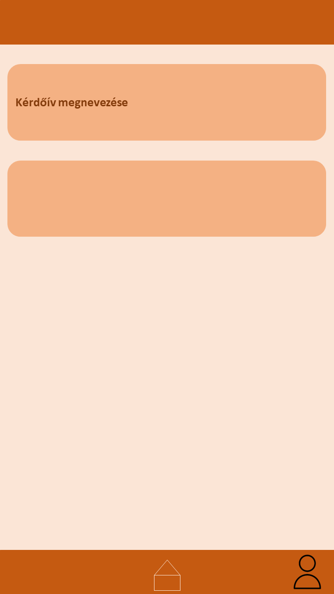

# Funkcionális Specifikációk(160 sor)

## Áttekintés
Az egyetem olyan szoftvert igényel, amely lehetővé teszi kérdőívek (questionnaires) használatát az
ott tanuló diákok adatainak gyűjtésére és értékelésére. Az alapvető cél az, hogy megértsék a diákok
véleményét és tapasztalatait az egyetemi élettel kapcsolatban, valamint az egyetemi szolgáltatásokkal
és oktatási programokkal kapcsolatban.

Az alkalmazásban minden diáknak saját felhasználói fiókja kell legyen, amelyet regisztrációval hoznak
létre. A regisztrációhoz egyetemi e-mail cím és jelszó szükséges, és ezek az adatok kerülnek tárolásra
egy adatbázisban. A felhasználóknak lehetőséget kell adni a be- és kijelentkezésre is.

Az alkalmazásnak lehetővé kell tennie az egyetem által létrehozott kérdőív könnyű kezelését.
A kérdőívnek felhasználóbarát felülettel kell rendelkeznie, amely lehetővé teszi a diákok számára a
könnyű navigációt és a kérdések egyszerű megértését. Nem adtak megszorítást a kérdőívek megjelenítésére,
az alkalmazásnak lehetőséget nyújthat különböző típusú kérdések (pl. válaszok, skála, szöveges válaszok) hozzáadására.

A felmérés során összegyűjtött adatokat biztonságosan és titkosan kell tárolni az adatbázisban, hogy
elkerüljük az illetéktelen hozzáférést. Csak a megfelelő jogosultságokkal rendelkező személyeknek
szabad hozzáférni az adatokhoz. Az egyes felhasználók által megadott válaszokat is biztonságosan kell
tárolni.

Az alkalmazásnak lehetővé kell tennie az összegyűjtött adatok statisztikai elemzését és riportok
készítését. Ez segíti az egyetemi vezetőket abban, hogy jobban megértsék a hallgatók véleményét és
az esetleges problémákat az egyetemen.

Összességében az alkalmazás célja a diákok véleményének és tapasztalatainak összegyűjtése és
értékelése az egyetemi élettel kapcsolatban, valamint az egyetemi szolgáltatások és oktatási programok
javítása. A projektnek kiemelten kell kezelnie az adatvédelmet, hogy biztosítsa az adatok biztonságos
kezelését és a felhasználók személyes adatainak védelmét.

## Jelenlegi helyzet
A hagyományos, papíralapú kérdőívek használata hosszú ideje szolgálta az adatgyűjtés és felmérések
célt, de ma már számos problémát hordoz magában, különösen az egyetemi környezetben:

* A papíralapú kérdőívek előkészítése és terjesztése jelentős költségekkel jár. Az egyetemnek pénzt
kell fordítania a nyomtatásra, papírra, nyomtató tintára és egyéb nyomtatási költségekre. Ezen felül
a papíralapú kérdőívek kézi feldolgozása és adatrögzítése további időt és pénzt emészt fel.
* A kérdőívek elkészítése és kiosztása hosszadalmas folyamat. Nehéz olyan időpontokat találni, amikor
a hallgatók könnyen hozzáférhetnek a kérdőívekhez, és nehéz ellenőrizni, hogy mindenkit elért-e a kérdőív.
Ezáltal a válaszadási arány csökkenhet.
* Az adatok kézzel történő rögzítése a számítógépen rendkívül időigényes és hibalehetőségekkel terhelt
folyamat. Az emberi hiba lehetősége fennáll, és az adatok elveszhetnek vagy megsérülhetnek.
* Gyakran előfordul, hogy a kitöltők hibás vagy hiányos adatokat adnak meg, vagy félreértelmezett kérdésekre
adnak válaszokat. Ez torzíthatja az eredményeket és nehezítheti az adatok értelmezését.

Ezzel szemben az online kérdőívek használata modern és hatékony alternatívát kínál az egyetemnek a papíralapú kérdőívekhez képest:
* Nincs szükség nyomtatásra, postázásra vagy kézi adatrögzítésre, így a költségek minimalizálódnak.
* Az online kérdőívek azonnal hozzáférhetők a diákok számára, és a válaszok automatikusan rögzülnek.
Ez lehetővé teszi, hogy az egyetem gyorsabban és hatékonyabban gyűjthesse az adatokat.
* Az online kérdőívek csak azokat a válaszokat fogadják el, amelyek megfelelő azonosítással és
válaszokkal rendelkeznek. Ez minimalizálja az emberi hibák és adatok helytelen rögzítésének lehetőségét.
* Az emberek bármikor és bárhol kitölthetik az online kérdőíveket az interneten keresztül.
Ez növeli a válaszadási arányt, mivel a diákoknak nincs szükségük fizikai jelenlétre.
* Az online platformok lehetővé teszik az adatok gyors és egyszerű elemzését. Az egyetem könnyen és
* gyorsan létrehozhat riportokat és statisztikákat az összegyűjtött adatok alapján.

## Követelménylista

| Modul  | ID  | Név | v. | Kifejtés                                                                            |
| ------ | --- | --- | -- | ----------------------------------------------------------------------------------- |
| Jogosultság | K1   | Bejelentkezési felület | 1.0 | A felhasználó a felhasználónevével és a jelszavával bejelentkezhet. |
| Jogosultság   | K2   | Jogosultsgi szint | 1.0 | A fejlesztők, hogy tudják módosítani a szoftvert, valamint a felhasználó, aki a megfelelő módon tudja használni. |
| Jogosultság | K3 | Regisztráció | 1.0 | A felhasználó ha az egyetem tanulója, az email címével, a felhasználónevével regisztrálhatja magát. |
| Feladattípus | K4 | Portál | 1.0 | A felhasználó választhat a kitöltendő kvízek közül. |
| Feladattípus | K5 | Kvíz | 1.0 | A felhasználó kitölti az általa választott kvízt |
| Feladattípus | K6| Értékelés | 1.0 |A felhasználónak a kvíz minden kérdésére válaszolnia kell. |
| Feladattípus | K7 | Új kvíz | 1.0 | A teszt végén a felhasználó másik kvízt is kitölthet. |
| Felület | K8 | Fejlesztői felület | 1.0 | A fejlesztők számára, a szoftver karbantartására. |
| Felület | K9 | Hibabejelentő | 1.0 | Esetlegesen felmerülő gond esetére egy visszajelző felület. |
| Felület | K10 | Új kvíz létrehozása | 1.0 | Az egyetemnek új kvíz létrehozásához szükséges jogok megadása. |
| Jogosultság | K11 | Adatkezelés | 1.0 | A diákok válaszainak illetéktelen kézbe való jutásának megelőzése. |
| Jogosultság | K12 | Adatfelhasználás | 1.0 | A jogilag és törvényes módon az adatok felhasználásának gondtalan levezetése. |

## Jelenlegi üzleti folyamatok modellje

Napjainkban továbbra is elterjedt a papír alapú kérdőívek használata, amelyek nyomtatása érdekében 
évente több ezer fa kerül kivágásra. Ez a gyakorlat sajnos súlyos környezeti hatásokkal jár, mivel 
a fafeldolgozás és a papírgyártás szén-dioxid-kibocsátással jár, és az erdőirtás veszélyezteti a 
biodiverzitást és a természetes élőhelyeket. A nagy mennyiségű papírhasználatunk tehát károsítja 
bolygónk egészségét és hozzájárul a klímaváltozás problémájához.

Ezenkívül ne feledkezzünk meg az ipari mennyiségű tintáról is, amely a kérdőívek nyomtatásakor kerül 
felhasználásra. A tinta előállítása is környezeti terhelést jelent, és a felesleges tintától való 
megszabadulás sem egyszerű feladat.

Világszerte évente több tonna használt papír halmozódik fel a kitöltött kérdőívek eredményeként, 
és sajnálatosan kevés ezek közül kerül újrahasznosításra. Ez azzal is jár, hogy a már egyszer használt 
papíranyagot további faanyagokra van szükség annak pótlásához, ami további erdőirtást eredményez.

Minden ez csak azért történik, hogy a kérdőívek tartalmazó lapokat egy rövid ideig használják fel. 
Azok, akik kitöltik ezeket a kérdőíveket, átadják azokat, és a megadott adatokat egy szakembernek kell 
beírnia a számítógépbe a szakszerű feldolgozás és statisztikai elemzés érdekében. Ebben a folyamatban 
gyakran előfordulhatnak problémák, például hiányos vagy olvashatatlan kérdőívek, amelyek tovább 
nehezítik a munkát és hozzájárulnak az erőforrások pazarlásához.

Ezek az aggályok és problémák rámutatnak arra, hogy sürgősen szükség van a digitális technológiák 
és az online adatgyűjtés előnyeinek kihasználására, hogy csökkentsük a papírfelhasználást, 
minimalizáljuk a környezeti hatásokat, és hatékonyabban dolgozzunk az adatokkal.

## Igényelt üzleti folyamatok modellje

Létrehozunk egy olyan felületet, amely képes az ún. szűrésre a felhasználók között. Ez kiemelten fontos, 
mivel szeretnénk a hallgatók tapasztalatai alapján szűrni a válaszadók között. Ezért a kérdőív 
kitöltése előtt egy rövid "tesztet" kérünk tőlük, amely segít megállapítani, mennyi tapasztalatuk van 
az adott témával kapcsolatosan. A felhasználók a kérdőív kitöltése során számos választási lehetőséggel találkozhatnak, például 
*  igaz-hamis
*  feleletválasztós, egy választási lehetőséggel
*  feleletválasztós, több választási lehetőséggel
*  saját válasz megadós
  
Ezen adatok természetesen titkosítva vannak, és tilos bárminemű visszaélés velük.

A hallgatók saját fiókkal kell, hogy rendelkezzenek, hogy ki tudják tölteni a kérdőívet, illetve az 
adminoknak is saját fiókjuk lesz, hogy hozzáférjenek a statisztikákhoz.

## Használati esetek

__Felhasználó__: A felhasználó regisztráció után bejelentkezhet az alkalmazásba. Az alkalmazás 
főoldalán a kitöltésre váró Kérdőívekre rákattintva azt a felhasználó kitöltheti. A Kérdőív több
típusú kérdést is tartalmazhat amelyek a továbbiak:
 * Nyitott kérdések: a válaszadó a saját véleményét fogalmazhatja meg az adott témában
 * Zárt kérdések:
   * Szelektív: több válasz lehetőség közül 1 válasz lehetőséget kell megjelölni
   * Skála: minősítési sorrend (pl. 1-5)

__Admin__: Kérdőíveket publikálhat az alkalmazásban a felhasználók számára. A kitöltött kérdőívek 
eredményeit megszemlélheti, statisztikát készíthet belőle

## Megfeleltetés, hogyan fedik le a használati esetek a követelményeket

A kérdőív kizárólag a hallgatók számára lesz elérhető, és kitölthető,

1. egyszerű adatgyűjtésre:

* igaz-hamis kérdés
* feleletválasztós kérdés
* kitöltendő kérdés

2. tematizált adatgyűjtésre:

* igaz-hamis kérdés
* feleletválasztós kérdés
* kitöltendő kérdés

## Képernyő tervek

 
  

Az első képen a bejelentkezési képernyőt látható, ahol egy email cím és jelszó megadását követően be is jelentkezhetünk az alkamazásba.

A második képen a regisztrációs képernyőn a regisztráció egy email cím és egy jelszó megadása után
meg is történik, amennyiben elfogadjuk az Adatvédelmi tájékoztatót.

A harmadik képernyőn az alkamazás fő képernyője szerepel ahol elsőként láthatjuk a kitöltésre váró
kérdőíveket. A képernyő alján lévő menüben láthatunk 2 gombot. A középen elhelyezkedő a fő képernyőhöz 
vezet minket, míg a jobb oldalon lévő a felhasználó profilját nyitja meg.

A profil képernyőn a felhasználó láthatja a regisztrációnál megadott adatait. Az adatok módositását 
elvégezheti a képernyő alján elhelyezkedő módositás gombbal. A mellette elhelyezkedő kijelentkezés gombbal pedig kiléphet
a felhasználói fiókjából.

Az utolsó képen pedig a kitöltés alatt álló kérdőívet láthatjuk. 

## Forgatókönyv

* Három szereplő vesz részt a programban
  * a felhasználó, aki a kérdőívet kitölti)
  * az admin, aki hozzáfér a kitöltési statisztikákhoz, szűrni tud
  * maga a szoftver, ami felületet biztosít a kérdőív kitöltésére
* Indításkor a bejelentkezési felület jön be
* A képernyő alján egy gomb segítségével a hallgató át tud menni a regisztrációs felületre, ahol regisztrál és bekerül az adatbázisba
* A bejelentkezési felületen csak az léphet be, aki már benne van az adatbázisban (az admin eleve benne lesz)
* Bejelentkezés után a főoldal jelenik meg, ahol a kitölthető kérdőív van
* A kérdőívre való kattintással elkezdődik a kitöltés
* A főoldal jobb oldalán elhelyezkledő emberi alakot ábrázoló ikonnal van lehetőség a profilra menni, majd onnan a középen lévő gombbal vissza a főoldalra
* A profil fül alatt lehetőség van kijelentkezni
* Ha admin jogosultságú felhasználóval jelentkezel be, akkor csak maga a statisztika fog megjelenni

---------TO DO---------

## Funkció - követelmény megfeleltetés 

A hallgató a felületen keresztül bejelentkezhet az egyetemi e-mail címe segítségével.
Ezután jöhetnek a kérdőív kérdései, mely legelején egy rövid teszt segítségével felmérjük, illetve 
megállapítjuk a kitöltő tapasztalatát az adott témában. A felmérés után jöhetnek a számunkra, illetve 
a statisztika számára is fontos kérdések. Ezen kérdések megjelenhetnek a következő formákban:
* két válaszlehetőség közül egy válasz kiválasztása
* több válaszlehetőség közül egy válasz kiválasztása
* több válaszlehetőség közül több válasz kiválasztása
* a kitöltő a saját szavaival válaszolhat a kérdésre

Az adatokat az arra szolgáló adatbázisban tároljuk el. 

## Fogalomszótár
+ Adatbázis: A számítógépen tárolt adatok összesége.
+ Szoftver: Az elektronikus adatfeldolgozó berendezések memóriájában elhelyezkedő, azokat működtető programokat értjük.
+ Adatbiztonság: Az összegyűjtött adatvagyon sérthetetlenségét, integritását, használhatóságát és bizalmasságát lehetővé tevő technológiák és szervezési 
módszerek összessége.
+ Cookie: Olyan kisméretű szövegfájlok, melyeket a webhely tárol el az oldalaikra látogató felhasználó számítógépén, illetve
  mobilkészülékén. Belső cookie-k azok,melyeket az Ön által felkeresett honlap használ. A belső cookie-k által gyűjtött információkat csak az adott honlap tudja feldolgozni és hasznosítani.
+ Szerzői jog: A szerzői művek alkotói számára biztosítja azt, hogy korlátozhassák műveiknek lemásolását és felhasználását egy
 meghatározott időtartam leteltéig.
+ Szellemi tulajdon: Biztosítja a fogyasztói bizalom megőrzéséhez szükséges kiadások megtérülését.
+ Regisztráció: Bejegyez egy felsorolásba, kimutatásba vagy listába.
+ Adat: Elemi ismeret, tények, fogalmak vagy utasítások formalizált ábrázolása, amely az emberek vagy automatikus eszközök
  számára közlésre, megjelenítésre vagy feldolgozásra alkalmas. Az adatokból az adatfeldolgozás eredményeként új ismeretek
  nyerhetők.
+ Felhasználási feltétel:  Felhasználási szerződés alapján a szerző engedélyt ad művének a felhasználására, a felhasználó pedig
  köteles ennek fejében díjat fizetni vagy értesíteni a felhasználót a műve felhasználásáról.
+ Applikáció: Egy számítógépes program, ami egy fordítóprogram segítségével készül el egy forráskódból.
+ Jogosultság: Hivatalos engedéllyel rendelkező személy, amelyet megilleti egy lehetőség, tulajdon. Másokkal ellentétben
  előnnyel felruházott (fél), aki engedélyt kapott egy cselekvésre, intézkedésre.
+ Kérdőív: Az adatközlők válaszainak rögzítésére szolgál, általában strukturált, előre rögzített kérdéssorok mentén.
+ Felhasználó: Az a személy  vagy szoftverágens, aki egy számítógépes vagy számítógép-hálózati szolgáltatás használója.
+ Admin: Szerkesztői jogokkal felruházott személy. Bármit módosíthat.
+ Adatgyűjtés:Adatgyűjtésnek nevezzük az adatok összegyűjtését és rögzítését akár gépi úton, akár emberi észlelő, leíró, rögzítő tevékenységgel történik, amely művelet során az elemek legalább sorszámmal, de legtöbbször ennél bővebb „azonosító adatokkal” azonosíthatók.
